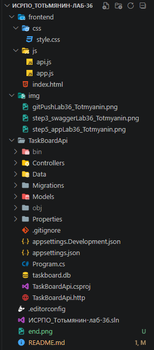
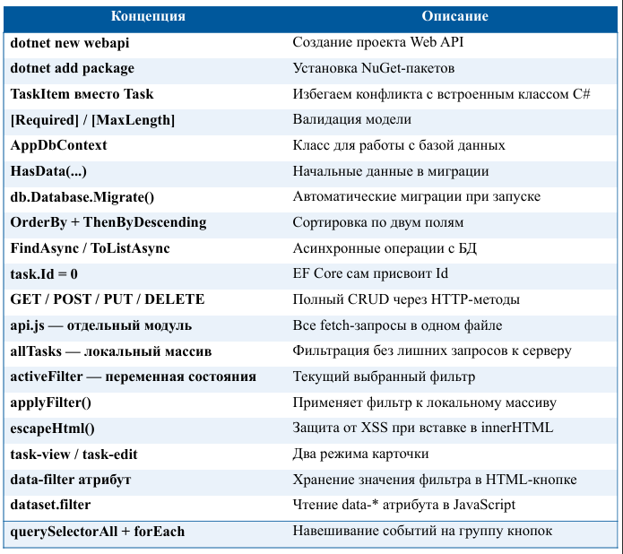

# Лабораторная работа №36. Итоговый проект: TaskBoard

P.S: НИ В КОЕМ СЛУЧАЕ ЭТА РАБОТА И ВСЕ ПОСЛЕДУЮЩИЕ И ПРЕДЫДУЩИЕ НЕ НАПИСАНЫ С ПОМОЩЬЮ GPT И ТОМУ ПОДОБНОЕ!!! (ну практически, кроме README.md)

## Основная информация

- **ФИО:** Тотьмянин Тихон Алексеевич

- **Группа:** ИСП-232

- **Дата:** 05.05.2026  

## Описание работы

**TaskBoard** — полноценное Fullstack-приложение для управления личными задачами.  
Проект объединяет серверную часть на **ASP.NET Core + EF Core (SQLite)** с клиентским интерфейсом на чистом **JavaScript (Fetch API)**. Реализован полный цикл CRUD-операций, асинхронное взаимодействие с сервером без перезагрузки страницы, фильтрация состояний и защита от XSS-атак.

## Что умеет TaskBoard

- **Просмотр списка** задач с автоматической сортировкой (невыполненные сверху, свежие первые)
- ➕ **Создание** новых задач (название + описание)
- ✅ **Переключение статуса** через чекбокс (выполнено / в работе)
- ✏️ **Inline-редактирование** прямо внутри карточки задачи
- 🗑️ **Удаление** с диалогом подтверждения
- 🔍 **Фильтрация** по вкладкам: «Все», «В работе», «Выполненные»
- 🛡️ **Защита от XSS** через экранирование пользовательского ввода
- 💾 **Автоматические миграции** БД при каждом запуске сервера
- **Настроенный CORS** для безопасных кросс-доменных запросов

## Структура проекта



## Запуск

```bash
cd TaskBoardApi
dotnet restore
dotnet run
```

## Итоговая таблица: что изучили в лабораторной


